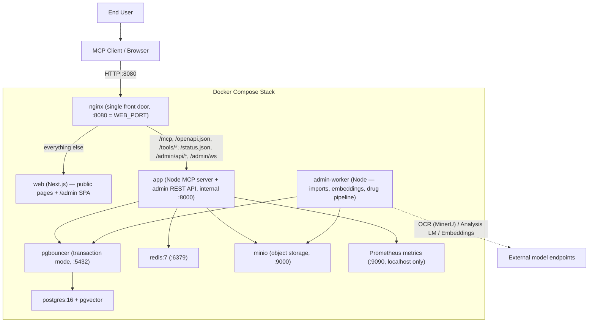

# Deployment Architecture

## Key considerations

1. **Single entry point**: nginx is the only service intended for host access (`WEB_PORT`, 8080 by default). `app` only has `expose`, no `ports`, so `:8000` cannot be reached from the host.
2. **Data persistence**: PostgreSQL and MinIO data live in Docker volumes, so the data survives container restarts and needs no re-import.
3. **Transport**: production uses `streamable-http` (through nginx's `/mcp`). `MCP_TRANSPORT=stdio` is for launching the process directly on a local machine.
4. **pgBouncer transaction mode**: incompatible with `LISTEN/NOTIFY` and named prepared statements; the Node side uses `pg`'s unnamed statements for compatibility.
5. **Data imports**: triggered from the admin console and executed in the background by `admin-worker` (there is no longer a standalone data-loader container). Source files are uploaded to MinIO through the admin console and fetched back when a job runs.
6. **MinIO**: stores drug document assets (inserts / labels / pill images); the tools return time-limited presigned download links.
7. **External model endpoints**: embeddings, OCR (MinerU), and the analysis LLM are all external HTTP services. Their endpoints live in `admin.llm_profiles` and are configured in the admin console's Settings tab; when unavailable, the system degrades (search falls back to keywords, and analysis jobs fail without affecting queries).
