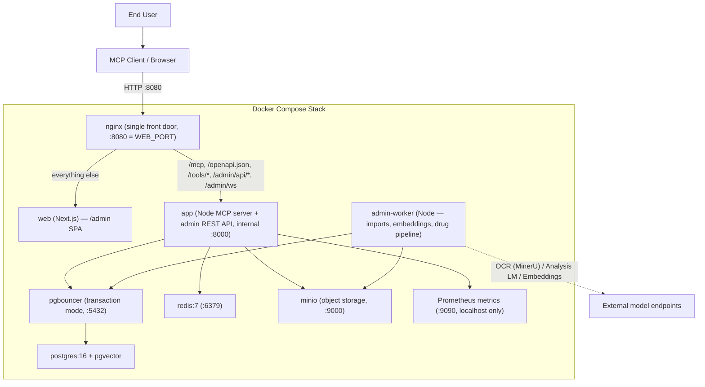

# 部署架構圖

## 關鍵考量

1. **單一入口**：nginx 是唯一對主機開放的服務（`WEB_PORT`，預設 8080）。`app` 只有 `expose`，沒有 `ports`，所以 `:8000` 無法從主機連入。
2. **資料持久性**：PostgreSQL 與 MinIO 資料存放於 Docker Volume，容器重啟後資料保留，無需重新匯入。
3. **通訊模式**：一律為 `streamable-http`（經 nginx 的 `/mcp`）。伺服器只提供這一種傳輸方式，沒有 stdio 模式。
4. **pgBouncer transaction mode**：不相容 `LISTEN/NOTIFY` 與 named prepared statements；Node 端使用 `pg` 的 unnamed statements 以相容此模式。
5. **資料匯入**：由管理後台觸發、`admin-worker` 背景執行（已無獨立的 data-loader 容器）。來源檔由管理後台上傳至 MinIO，工作執行時再取回。
6. **MinIO**：儲存藥品文件資產（仿單 / 標籤 / 外觀圖），工具回傳有時效的預簽下載連結。
7. **外部模型端點**：嵌入、OCR（MinerU）與分析 LLM 都是外部 HTTP 服務，端點存於 `admin.llm_profiles`，於管理後台 Settings 設定；不可用時系統降級（搜尋退回關鍵字、分析工作失敗但不影響查詢）。
